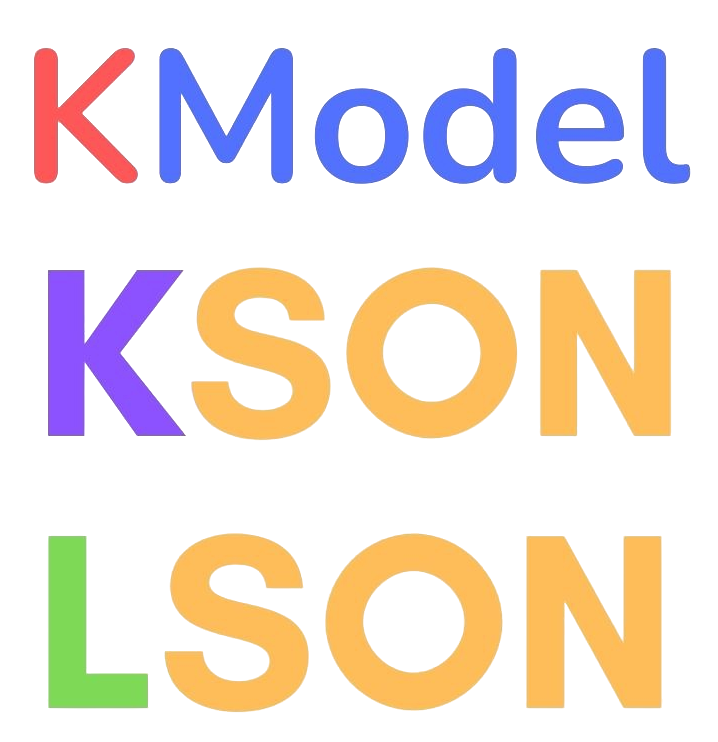

<html>
    <center>
        </img>
        <h3>Type-Safe configuration file</h3>
    </center>
</html>

# Undestanding KSON
```kson
# config.kson

# Get var USER_TOKEN and USER_KEY in env
@env(USER_TOKEN)
@env(USER_KEY)

username = "Liy"
token = USER_TOKEN
public_key = USER_KEY
```

# Undestanding KModel
```kmodel
# config.kmodel

username: String
token: String
public_key: String?
```

# How to compile to LSON
```bash
lson compile config.kson
```

